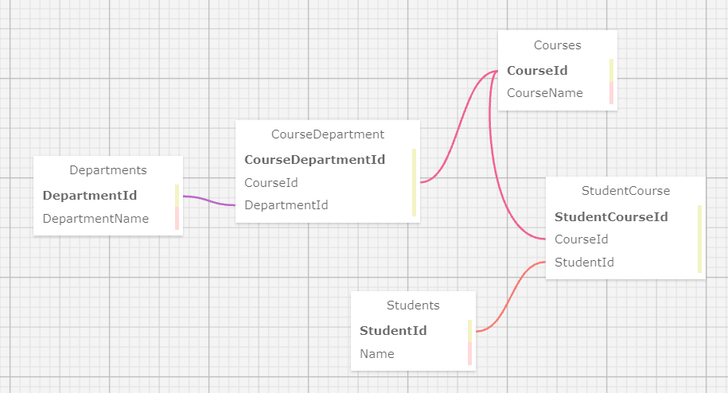

<div align="center">

[![Language][language-shield]][language-url]
[![Language][languageH-shield]][languageH-url]
[![Language][languageC-shield]][languageC-url]
[![MIT License][license-shield]][license-url]


# University Registrar


#### _By Kevin Funez & Paige Tiedeman_  

<br>

#### This is a C# web application using MySQL databases and Entity to collect students, courses and their associated departments.  

<br>

    
  
</div>

## Technologies Used

* C#
* .NET v5.0
* ASP.NET Core MVC
* HTML 
* Bootstrap
* MySQL
* CSS
* MySQL Workbench
* Razor
* Entity Framework Core
* .NET Core CLI

## Description

A website where users can view students and associated courses, courses and associated students and then departments and associated courses. 

## Installation Requirements

* _Clone or download the zip file of this repository to your desktop_
* _Navigate into the top level directory_
* _Open in your code editor_
* _Commit and push your .gitignore file to your repo_
* _Add the file UniversityRegistrar/University/appsettings.json and insert the following:_
```
{
  "ConnectionStrings": {
    "DefaultConnection": "Server=localhost;Port=3306;database=university;uid=[YOUR-UID];pwd=[YOUR-PASSWORD-HERE];"
  }
}
```
* _Insert your MySQL password and user Id_
* _Make sure to have .NET 5.0 installed_
* _Run `$ dotnet restore` to install bin & obj folders_
* _Make sure to have EntityFrameworkCore.Design 5.0 added and dotnet ef installed globally_


## Steps To Use
* _In your terminal navigate into UniversityRegistrar.Solution/University_
* _If Migrations folder is not present run `$ dotnet ef migrations add Initial` to add Migrations folder_
* _Then run `$ dotnet ef database update` to create the schema_
* _Run `$ dotnet build` to build the site_
* _Run `$ dotnet run` to start the live server_
* _Click either button to see all restaurants, cuisines or reviews_
* _After clicking add students, courses or departments put in your inputs and hit submit to reveal the lists!_

## User Stories

<details>
<summary> As A Registrar..</summary>

 * I want to enter a student, so I can keep track of all students enrolled at this University. I should be able to provide a name and date of enrollment.
* I want to enter a course, so I can keep track of all of the courses the University offers. I should be able to provide a course name and a course number (ex. HIST100).
* I want to be able to assign students to a course, so that teachers know which students are in their course. A course can have many students and a student can take many courses at the same time.
* I want to be able to create departments. A student can be assigned to a department when they declare their major and a course can be assigned to a department when it is created.
* I want to be able to list out all of the courses or all of the students in a particular department.
</details>

## Known Bugs

* _Auto Increment does not reset for tables_

## License

MIT: See Badge at top for Info  
Copyright (c) 2021 Kevin Funez and Paige Tiedeman  

## Contact Information

_Paige Tiedeman @ github.com/paigetiedeman_  
_Kevin Funez @ github.com/KevinFunez5_  

[license-shield]: https://img.shields.io/badge/License-MIT-blue
[license-url]: https://opensource.org/licenses/MIT
[language-shield]: https://img.shields.io/badge/Language-C%23-green
[language-url]: https://docs.microsoft.com/en-us/dotnet/csharp/
[LanguageH-shield]: https://img.shields.io/badge/Language-HTML-red
[LanguageH-url]: https://developer.mozilla.org/en-US/docs/Web/HTML
[LanguageC-shield]: https://img.shields.io/badge/Language-CSS-blueviolet
[LanguageC-url]: https://developer.mozilla.org/en-US/docs/Web/CSS